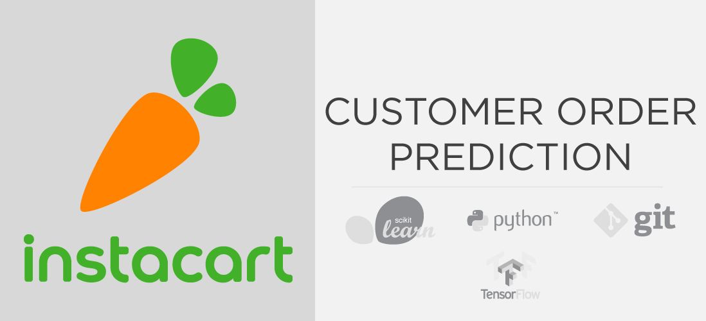

# Business Intelligence | Instacart Customer Order Prediction

This is a multi-label supervised learning project that helps predict the next purchase of an InstaCart customer

This is a work in progress. To see my current work, please navigate to:  

## [Exploratory Data Analysis](https://github.com/nazra-inari/Business_Intelligence_Instacart_Customer_Purchase_Prediction/blob/master/Exploratory%20Data%20Analysis.ipynb)  
* Establishes a data dictionary and the entity relationship diagram to gain a firm understanding of the 30 million data points.  
* Analyze the information in all seven tables of the schema and drive data insights via data visualizations  
* Gain an understanding of the important features embedded in the data    
## [Data and Feature Engineering](https://github.com/nazra-inari/Business_Intelligence_Instacart_Customer_Purchase_Prediction/blob/master/Data%20and%20Feature%20Engineering.ipynb)
* Generate 2300 features to help predict the response variable  
* Abstract computation into functions to avoid code repetition  
* Write tests to ensure feature validity  
* Perform parallel computation on multiple processors to expedite results and save time  
* Transform data for machine learning and statistical modeling  
* Optimize final sparse data set to save space, read and write times  

## Model Building and Hyperparameter Optimization
* Currently in progress
